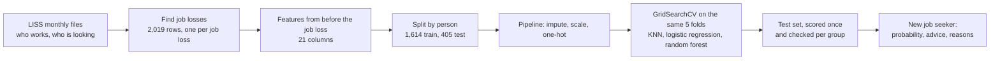

# Who needs early help?

AI for Good, Hackathon 5: Model Showdown
*Lucas Jansze & Minhyeok Sung*

We built a scikit-learn model that predicts, at the moment someone loses their job, whether they will still be without paid work a year later. It is meant for the work coaches of UWV, who have to decide in the first weeks of an unemployment benefit who they invite for a face-to-face conversation and who starts with online services only.

The project is also a check on the idea itself. UWV already sorts new claimants with an algorithm. We wanted to know how accurate a model like that can be, who it gets wrong, and whether it is realistic and ethical to sort people this way. The short answer: our best model is only a little better than inviting everyone aged 40 or older, and it misses most of the young people who get stuck.

| | |
|---|---|
| Notebook | [`uwv_long_term_unemployment.ipynb`](uwv_long_term_unemployment.ipynb), saved with all outputs |
| Ethical reflection | [`ETHICS.md`](ETHICS.md) |
| Data | LISS panel, not in this repository. How to get it: [`data/README.md`](data/README.md) |
| Variables, question texts and answer codes | [`docs/liss_overview.md`](docs/liss_overview.md), made by [`scripts/liss_inventory.py`](scripts/liss_inventory.py). Contains no respondent data |
| Slides | [`Who_needs_early_help.pptx`](../presentation/Who_needs_early_help.pptx), with speaker notes |
| Tool | scikit-learn 1.9: KNN, logistic regression and random forest |
| SDG | SDG 8 Decent Work and Economic Growth, target 8.5 |

> **You cannot rerun this notebook without your own copy of the data.** LISS data may not be passed on, so we could not put it in the repository and a download cell is not possible either. Anyone can request access for free (see [How to run](#how-to-run)). Until then the saved outputs in the notebook are the proof that it runs from the raw files to the final prediction. The notebook shows no individual people: only counts, percentages and scores for groups, and a group smaller than 10 people is not shown separately.

---

## Problem definition

In the second quarter of 2025, 378 thousand people in the Netherlands were unemployed, and 51 thousand of them had been looking for work for more than a year (CBS, 2025). Most people who lose their job claim unemployment benefit (WW) from UWV. At the end of December 2025 UWV counted 191,500 running WW benefits, almost 10% more than a year earlier, and it expects 217,700 by the end of 2026 (UWV, 2026).

The longer someone is out of work, the harder it gets to find a job. CPB (2015) gives two reasons: people lose skills while they are unemployed, and employers read a long gap on a CV as a sign that someone is less productive. Older workers are hit hardest. They do not lose their job more often than others, but once they are unemployed their chance of becoming long-term unemployed is almost twice the average. There is also a financial side. WW lasts at most 24 months. After that comes *bijstand* (social assistance), where people first have to use up their savings and where the income of a partner counts.

UWV decides in the first weeks who gets personal help. When someone applies for WW they fill in a questionnaire, and UWV's algorithm, the Werkverkenner, estimates the chance that they are back at work within 12 months. People with a chance below 50% are invited for a conversation with a work coach shortly after their benefit starts. Everyone else starts with online services and has a first conversation in the seventh month of their benefit, unless the coach decides to invite them earlier (UWV, 2022).

This sorting touches a lot of people. In the group UWV studied, 179,840 people started a WW benefit between December 2017 and December 2018. Of the people who filled in the questionnaire, 41,202 got a score of 50% or lower and 90,689 a higher score (UWV, 2022). So about seven in ten of the people with a score were placed in the group that starts with online services.

This is where it goes wrong for some people. The Werkverkenner predicts correctly for about 70% of WW claimants (UWV, 2018), so roughly three in ten get the wrong prediction. Someone who is predicted to find work quickly but does not can wait half a year for a first conversation. That help matters: in UWV's own experiment, personal service raised the share of people in work two years later from 57% to 59%, about 2,000 extra people back at work, with €201 million in benefits to society against €97 million in costs (UWV, 2022).

What UWV does not publish in its algorithm register is who those three in ten are. Does the algorithm miss young people as often as older people, or men as often as women? We cannot test the Werkverkenner itself. Everything we measure is about our own model. What we can do is build the same kind of model on Dutch research data, check it the way we think UWV's model should be checked, and see what that says about the approach.

**Our questions:**

1. At the moment someone loses their job, and using only what is known at that moment, can we predict who will still not be back in paid work twelve months later?
2. Does the model make the same mistakes for everyone?
3. What does that tell us about sorting job seekers with a model: how accurate can it be, and is it realistic and ethical?

### Does our data match the people the model is for?

Better than most survey data, but not exactly. UWV's population is people at the start of a WW benefit. Ours is 2,019 job losses of LISS panel members aged 18 to 66 who went from paid work in one month to *job seeker following job loss* in the next, between November 2007 and 2025. LISS follows the same people every month, so we can see the job loss when it happens, measure everything before it (the moment of UWV's intake) and see what happens in the twelve months after.

Two things do not match. Not everyone who loses a job claims WW. And LISS records someone's main activity as the household reports it, not whether they receive a benefit. The dataset card at the bottom lists the other limitations.

## SDG 8: Decent Work and Economic Growth

SDG 8 is the United Nations goal to "promote sustained, inclusive and sustainable economic growth, full and productive employment and decent work for all". Target 8.5 makes that concrete: by 2030, full and productive employment and decent work for all women and men, including young people and persons with disabilities. Progress is measured with indicator 8.5.2, the unemployment rate by sex, age and disability.

Our project fits this target in two ways. It is about getting people back into work: long-term unemployment is the part of the unemployment rate that is hardest to bring down, and the help that prevents it is scarce. And the target says "for all" and names young people and people with disabilities. That is why we did not stop at one overall score. We checked the model separately for age groups, for men and women, per origin group and for people with a long-standing disease, and found that it works much worse for young people. The people who benefit if this works are job seekers who would otherwise be seen too late.

## User group

### Who uses the prediction: UWV work coaches

The user is the UWV work coach (*adviseur werk*) who handles new WW claimants. They are the ones who talk to job seekers and decide what help someone gets.

Their situation has changed a lot in the last years. After budget cuts, UWV offered only online services to WW claimants for several years. Since 2017 coaches hold personal conversations again, but not with everyone at the start, and UWV itself writes that it needs enough capacity to give people with poor job chances the help that works for them (UWV, 2022). So the coach works with a score. The low scorers are seen shortly after their benefit starts, the others in month seven.

The numbers show what that means in practice. More than 90% of the low scorers had at least one conversation with a coach. Of the high scorers 52% had one before they left WW, because most of them only qualify after six months. Conversations are about three quarters of all personal service UWV gives (UWV, 2022). The score is built from eighteen factors out of UWV's records and the intake questionnaire, and only the UWV employee can see it, not the job seeker (UWV, 2022; UWV algorithm register).

Coaches do not follow that score blindly. About three in ten people with a good score are invited earlier anyway, because the coach has other information that makes them think the chances are worse than the score suggests, or because the job seeker asks for it (UWV, 2022). That tells us what a coach needs from a model. They need a signal at intake that they can question, with reasons they can repeat to the job seeker. And they need to know where the signal is weak, so they know when to trust their own judgement more.

This is why a logistic regression fits this user better than a more complex model. It shows which factors push someone's risk up or down, so a coach can say "you are invited early mainly because of your age and your sector". Our group check adds what the coach cannot see from one score: the model is least reliable for young people. Of the young people who became long-term unemployed it found 18% on the test set and 12% in cross-validation.

The coach uses the prediction at one moment only, in the first weeks of a WW benefit, and only with information that is known then. A second stakeholder is the UWV team that sets the threshold, because the threshold decides how many people are invited early. That is a capacity decision and not something a coach decides per person.

### Who the prediction is about: people who just lost their job

These are people aged 18 to 66 in the first weeks of unemployment. The range runs from adulthood to just before the state pension age, when the right to WW ends.

What their situation looks like depends strongly on age. Young people are often unemployed, but mostly for a short time. For people over 55 it is the other way around: once they are unemployed, their chance of finding a job is small and many become long-term unemployed. More than 40% of the long-term unemployed were over fifty when CPB studied this (CPB, 2015). UWV sees the same in its own clients. The people with a low Werkverkenner score are on average older, more often have trouble with the Dutch language and rate their own health as worse (UWV, 2022).

Our data shows the same pattern. Of the 2,019 job losses, 23% are of people aged 18 to 29, 43% of people aged 30 to 49 and 34% of people aged 50 to 66. Overall 39% were still not back in paid work twelve months later: 25% of the youngest group, 36% of the middle group and 53% of the oldest. The share is also higher for people who migrated to the Netherlands themselves (57%), people with a long-standing disease (51%) and lower-educated people (44%). Women (41%) are slightly more often long-term unemployed than men (37%).

For these people the prediction decides whether they talk to a person in their first weeks or after half a year. They do not choose to be scored, which is why the ethical reflection is written from their side.

### Who it is not for

The model must not be used by employers or recruiters, because a risk score should never be used to screen applicants. It is also not for fraud or enforcement teams, inside or outside UWV. A risk of long-term unemployment says nothing about fraud, and a UWV experiment showed that the extra conversation with a coach helped people find work while imposing an obligation to search more broadly had the opposite effect (Universiteit Leiden, 2024). Finally it is not for municipalities and their *bijstand* clients. That is a different population and the model was not built or tested for it.

### Who is missing from the data

LISS questionnaires are in Dutch, so people who do not read Dutch well are hardly represented. That is a real gap, because UWV's own research names language problems as typical for the group with poor job chances. People who do not want to join a monthly panel are not in the data, and people who left the panel during their unemployment were dropped (74 job losses). People under 18 or over 66, people living in institutions and undocumented workers are not in the data at all.

## Solution: from raw data to a recommendation

**Input:** what is known about one job seeker at intake. That is age, education, household, how urban their area is, net income in the last job, how many months they were looking for work in the three years before, the job they lost (contract type, public or private, hours, years with the employer, sector, occupation, supervising others, firm size) and their health before the job loss.

**Output:** the probability that this person is still not back in paid work after 12 months, and an advice: *invite early* or *start with online services*.

How the code gets from one to the other: LISS has a file for every month with each person's main activity. The notebook lines these up per person and looks for the month where someone goes from paid work to job seeker. That month is one row. It then looks back for features and forward eleven months for the answer. Three scikit-learn models learn the link between the two on 80% of the rows and are scored on the other 20%. The best one is then used on a new case.

The notebook follows the ten required steps, each with a markdown cell that explains what we did and why.

1. Frame the problem. The positive class is "not back in paid work 12 months after the job loss". A missed person (false negative) is worse than an unnecessary conversation (false positive). The main metric is balanced accuracy, because "invite nobody" and "invite everyone" both score 0.5 on it. Accuracy would reward inviting nobody and recall would reward inviting everyone.
2. Explore the data. We read 220 monthly Background Variables files and all waves of the core studies *Work and Schooling* and *Health*, and build the job losses. Every feature is taken from before the job loss: the last month in work, the 36 months before it, and the latest interview in the 24 months before. *Don't know* codes and impossible values (a working week of 0 or 90 hours, a start year in the future) become missing. Everything measured after the job loss is left out, because it would leak the answer.
3. Split first. 80/20, stratified and grouped by person with `StratifiedGroupKFold` and `random_state=42`. 352 people lost a job more than once. All their job losses stay on one side, so the model cannot score well by recognising a person.
4. Pre-process in a pipeline. A `ColumnTransformer` fills missing numbers with the median and adds a *was missing* column, gives missing answers their own category, scales the numbers and one-hot encodes the answers. It is fitted on training data only.
5. Set baselines. `DummyClassifier(most_frequent)`, the rule "invite everyone aged 50 or older", which is what a coach could do without any model, and the same rule with the best age cutoff from cross-validation (40).
6. Tune. `GridSearchCV` with the same five person-grouped folds and the same metric for all three models, with a plot of the score against `n_neighbors`, `C` and `max_depth`.
7. Test once. Confusion matrices, precision, recall, F1 and balanced accuracy, with the train, cross-validation and test scores next to each other.
8. Look at the errors. The average profile of the long-term cases the model missed, and recall per age band, gender, education, origin and long-standing disease. We do that check twice, on the test set and with cross-validation on the training set, because some test groups are small. Then three experiments: the model with and without migration background, with and without health, and with and without gender. Migration background and gender stay out of the model, health stays in.
9. Recommend. A threshold chosen on cross-validated probabilities of the training set, a comparison with the age rules at the same share of people invited, and the coefficients of the logistic regression.
10. Use it. A made-up job seeker gets a probability, an advice and the three answers that raise and lower the score most.

### Comparison table (test set, scored once)

The training set has 1,614 job losses and the test set 405, with 39% long-term in both and no person in both.

| Model | Best hyperparameters | CV balanced accuracy (mean ± std) | Test precision | Test recall | Test F1 | Test balanced accuracy |
|---|---|---|---|---|---|---|
| Baseline: most frequent | none | 0.500 ± 0.000 | 0.000 | 0.000 | 0.000 | 0.500 |
| Baseline: age ≥ 50 | threshold 50 | 0.603 ± 0.020 | 0.492 | 0.411 | 0.448 | 0.570 |
| Baseline: best age cutoff | threshold 40 | 0.609 ± 0.018 | 0.478 | 0.677 | 0.560 | 0.602 |
| KNN | n_neighbors=9, weights=uniform | 0.592 ± 0.007 | 0.481 | 0.323 | 0.386 | 0.550 |
| **Logistic regression** (recommended) | C=0.1, class_weight=balanced | 0.638 ± 0.021 | 0.521 | 0.633 | 0.571 | 0.630 |
| Random forest | max_depth=3, min_samples_leaf=5, class_weight=balanced | 0.642 ± 0.026 | 0.471 | 0.513 | 0.491 | 0.572 |

Train, cross-validation and test balanced accuracy: logistic regression 0.67 / 0.64 / 0.63 (a little overfitting, and the test set confirms the cross-validation), random forest 0.69 / 0.64 / 0.57 (it does much worse on the test set than cross-validation promised), KNN 0.66 / 0.59 / 0.55 (the weakest model, below both age rules on the test set).

### Who does the model miss?

Share of the long-term cases the logistic regression finds (recall at threshold 0.5), on the test set and with cross-validation on the training set. The number in brackets is how many long-term cases the recall is based on.

| Group | Test set | Training set (cross-validation) |
|---|---|---|
| Age 18-29 | 0.18 (17) | 0.12 (102) |
| Age 30-49 | 0.51 (76) | 0.46 (237) |
| Age 50-66 | 0.89 (65) | 0.88 (292) |
| Women | 0.70 (82) | 0.60 (317) |
| Men | 0.57 (76) | 0.60 (314) |
| Dutch background | 0.71 (93) | 0.64 (427) |
| First generation migrant | 0.70 (27) | 0.68 (71) |
| Second generation migrant | 0.33 (18) | 0.47 (58) |
| No long-standing disease | 0.60 (83) | 0.60 (327) |
| Long-standing disease | 0.91 (33) | 0.81 (139) |

The age gap shows up in both columns, so we trust it. The gap between men and women on the test set disappears on four times as much data, so it was chance. The share of long-term cases per group in the full data:

## Recommendation

Of the three models we recommend the logistic regression, as support for the work coach and not as the decision-maker. We also have to say that it adds little to a simple age rule.

In cross-validation it is as good as the random forest. The difference is 0.004, far below the spread over the folds of about 0.02. We decided beforehand that when two models are equally good we take the one that can be explained, and that is the logistic regression. It also holds up much better on the test set (0.630 against 0.572). KNN is clearly weaker and on the test set scores below both age rules.

Against a rule without machine learning the lead is small. The logistic regression clearly beats "invite everyone aged 50 or older" (0.630 against 0.570 on the test set). Against the best age rule, "40 or older", it is 0.638 against 0.609 in cross-validation and 0.630 against 0.602 on the test set. When both invite about the same share of people, the rule finds 107 of the 158 long-term cases and the model 118, for 10 more invitations. A model with 21 features, three of them about health, does a little better than one question about age.

The threshold is a choice for UWV, because it depends on capacity. At 0.5 the model invites 47% of job seekers and finds 63% of the people who become long-term unemployed. At 0.35 it finds 86%, but it invites 77% of everyone and only 44% of those invitations turn out to be needed. A missed person is the worse mistake, so 0.35 is the setting to use if UWV can see about three in four people early, and 0.5 if it cannot. One warning belongs with that. At 0.35 the balanced accuracy on the test set drops to 0.576, about the same as "50 or older" (0.570) and below "40 or older" (0.602). At that setting the model finds more people mainly because it invites more people, not because it chooses better.

The model is not good enough to decide alone. Roughly four in ten people in each group are classified wrongly, and the mistakes are not spread evenly. Of the long-term unemployed aged 18 to 29 the model finds only 18% on the test set and 12% in cross-validation. The gap between men and women that we saw on the test set (57% against 70%) did not hold up: on the training set it is 60% for both. So a score should only ever add people to the early list. A coach can always invite someone, and should look twice at young people and at people whose job history is unknown. Before any real use the model has to be retrained on recent UWV data of WW claimants, with the group check repeated each time.

Our numbers cannot be compared with the 70% of the Werkverkenner. That figure is accuracy, on a different population, with a questionnaire about attitude and job search that we do not have.

### What this says about a model like the Werkverkenner

On our test set, predicting "back in work" for everyone is right for 61% of the people. Our best model is right for 63%. In plain accuracy a model with 21 features is two percentage points better than knowing nothing. The difference only shows in recall: the dummy finds none of the people who need help and the model finds 63% of them.

That matters for how to read UWV's 70%. It only means something next to the share you get right by predicting the same for everyone, and we could not find that share in the UWV publications we used. We cannot say whether the Werkverkenner is better than our model. It uses a questionnaire about job search and attitude that we do not have, so it may well be.

What our numbers do suggest is a ceiling. With what is known at intake, who is still without work a year later is hard to predict. Three different kinds of model end up between 0.59 and 0.64 in cross-validation, and one question about age gets to 0.61. Much of what decides the outcome is not in the data: the job market in that region and year, someone's network, motivation and luck.

We think sorting job seekers with a model can be defended under three conditions. The score may only add help, because the errors are too frequent to let it take help away. The errors per group have to be published, because a single accuracy number hides that ours fall mostly on young people. And nobody should present the model as more than it is: a weak tool that is a little better than a simple rule, used because UWV cannot see everyone in the first weeks and someone has to choose.

### The decision we would defend hardest

Splitting by person. In our data 352 people lost a job more than once. A normal random split would put some of their job losses in the training set and others in the test set. The model could then partly recognise the person (same education, household and job history) instead of predicting for someone new, and the test score would come out too high without any error message. We used `StratifiedGroupKFold` so that all job losses of one person are on the same side, for the test set and for all five folds. We would defend this hardest because every other number in the notebook depends on it. A leaky split would have flattered our model, and the point of this project is to see how good such a model really is.

## Problem-solution fit

The problem is that some people who will get stuck are not seen in their first weeks, and that nobody outside UWV can see which groups this happens to. Our solution addresses both parts. It gives a risk score at the same moment and for the same decision the coach already makes, so it adds no new step to their work. And every score comes with a check per group, so the coach knows where it is weak.

The metric follows from the cost of the two mistakes. A missed person waits months for help while their benefit runs down. An extra conversation costs a coach some time. Balanced accuracy stops a model from looking good by inviting nobody or everybody, and the threshold then trades extra conversations for fewer missed people.

Machine learning beats the simple alternatives only just. Without a model a coach could invite everyone over 50. On the test set that rule finds 41% of the long-term cases. The logistic regression, set to invite about the same share of people, finds 48%. But a coach could also invite everyone aged 40 or older, and that rule comes close to the model: 0.602 against 0.630 on the test set. When both invite about the same share, the rule finds 107 of the 158 long-term cases and the model 118.

So why still a model? An age rule never invites anyone under 40, whatever their situation, and it selects on age alone. The model can invite someone under 40 whose job and health point to a high risk. It gives reasons a coach can discuss with the job seeker, and its threshold can follow UWV's capacity in small steps. Those are mostly reasons of fit. The gain in accuracy is small, and we want to be clear about that. Inviting everyone is not possible with UWV's capacity, and inviting nobody comes down to the online-only service UWV had before 2017.

There is one limit we want to be open about. Our model predicts who is at risk, not who is helped by a conversation. UWV's evaluation found that conversations alone mostly helped people with a medium chance of work. For people with the lowest chances a conversation did not clearly raise their job chances, and they need heavier help such as training (UWV, 2022). The first conversation is where a coach decides on that heavier help, so being invited early still matters for them. But a risk score does not replace knowing what works for whom.

## Ethical reflection

The full reflection is in [`ETHICS.md`](ETHICS.md). The short version: the biggest risk is that the model misses exactly the people who do not fit the usual picture, mainly young people, and that they then wait months for help. We responded by choosing balanced accuracy, lowering the threshold, checking recall per group and making it a rule that a score can only add help. We left migration background out of the model, because it did not make the model clearly better and would score people on where they were born, and we check per origin group instead. By that same rule we took gender out: it did not improve the model and made it invite women more often than men. Health information stays in, but only if answering is voluntary and declining can never lower someone's chance of an invitation. The LISS data is not in this repository, the notebook shows no individual people and we do not save a trained model.

## Dataset card

| | |
|---|---|
| Source | LISS panel (Longitudinal Internet studies for the Social Sciences), [LISS Data Archive](https://www.dataarchive.lissdata.nl/). Download instructions in [`data/README.md`](data/README.md) |
| Collected by | Centerdata (Tilburg University, The Netherlands) |
| How | Online questionnaires filled in by a panel of about 5,000 households, drawn as a probability sample from the population register by CBS. Households without a computer or internet get one. The contact person of the household updates the *Background Variables* (including everyone's main activity) every month. The core studies *Work and Schooling* and *Health* are asked once a year |
| When | Background Variables: November 2007 to March 2026 (November 2022 is missing). Work and Schooling: 18 waves, 2008-2025. Health: 18 waves, 2007-2025 |
| Licence | Free for scientific research after registering and signing the *statement on the use of LISS data*. The data may not be passed on. Publications acknowledge the LISS panel (see `data/README.md`) |
| Size | Raw: 2,424,987 person-months of 34,301 people, 101,691 Health interviews and 104,288 Work and Schooling interviews. After building job losses (paid work to job seeking, outcome known after 12 months, aged 18-66): 2,019 rows, one per job loss, of 1,455 people. 21 features (10 numeric, 11 categorical), plus gender and migration background for fairness checks only |
| Target | `long_term`: not back in paid work (LISS `belbezig` 1-3) in the eleven months after the first month of job seeking. 1 = yes (39.1%), 0 = no (60.9%) |
| Known limitations | (1) *Job seeker following job loss* is the main activity reported by the household, not WW receipt. (2) Job and health features come from the latest interview in the 24 months before the job loss. They are missing for about 30% of job losses and may describe an earlier job. (3) 103 job losses were dropped because the outcome is unknown (notebook step 2b): 74 because the person left the panel before month twelve, which may not be random, and 29 because the job loss was too recent to see month twelve (split in [`docs/liss_overview.md`](docs/liss_overview.md)). (4) November 2022 is missing, so job losses in November and December 2022 are partly not detected. (5) 352 people have more than one job loss, which is why we split by person. (6) Only people who answer Dutch questionnaires. (7) 2007-2025 includes the financial crisis and COVID, so chances in a new period may differ. (8) The analysis is unweighted, so it describes the panel and not exactly the Dutch population |

## How to run

The LISS data cannot be downloaded by a script, so the notebook only runs with your own copy.

1. Request access at the [LISS Data Archive](https://www.dataarchive.lissdata.nl/) and sign the statement on the use of the data.
2. Download in Stata (.dta) format, English version: *Background Variables* (all months), *Work and Schooling* (all waves) and *Health* (all waves). Put them, zipped or unzipped, in `data/liss/background/`, `data/liss/work_schooling/` and `data/liss/health/` inside the `hackathon/` folder ([details](data/README.md)). The notebook unzips them itself.
3. Locally: `pip install pandas numpy scikit-learn matplotlib notebook` (or `ipykernel` for VS Code), open `uwv_long_term_unemployment.ipynb` from the `hackathon/` folder and choose *Restart & Run All*. Reading the 220 monthly files takes a few minutes.
4. In Google Colab: put the same folders in your own Google Drive under `MyDrive/liss/` (do not share that folder), open the notebook in Colab and choose *Runtime → Run all*. The notebook asks to mount your Drive. No installs are needed.

Built and run with Python 3.12, pandas 3.0, numpy 2.5, scikit-learn 1.9 and matplotlib. `random_state=42` is used everywhere. Other package versions can shift numbers in the third decimal.

## How we used the tool

Everything after loading the data is done with scikit-learn, and the project would not exist without it. `StratifiedGroupKFold` makes the test split and the folds, which is what keeps one person from ending up on both sides. The `Pipeline` with a `ColumnTransformer` makes sure imputing, scaling and encoding are learned from training data only. `GridSearchCV` tunes `KNeighborsClassifier`, `LogisticRegression` and `RandomForestClassifier` on the same folds and the same metric, which is what makes the comparison fair. `DummyClassifier` gives the baseline, `cross_val_predict` gives the probabilities for choosing the threshold and for the fairness experiments, and `sklearn.metrics` gives the confusion matrices and scores.

**How we used AI.** We searched for topics and datasets ourselves and made a first plan: the problem, the user and the data. We improved that plan with Claude. We then wrote a plan for the code, step by step along the ten required steps, and implemented it with Claude Code, with us directing and checking each step. Claude also helped with improving the wording of this README and the slides; we checked every number against the notebook outputs.

## What we learned

### Lucas Jansze

I learned that the most important decision in a project can be one that nobody sees. In our data 352 people lost a job more than once, and a normal random split would have given us a better score without any warning that it was wrong. I also learned that a better model does not always help: three different kinds of model ended up almost the same, because much of what decides who finds work is not in the data. And I learned to do the fairness check early. We only tested gender at the end, saw that it failed the rule we used for migration background, and had to take it out and rerun everything.

### Minhyeok Sung

I thought a computer model would be much better than a simple rule, but our model was only a little better than "invite everyone aged 40 or older." So I learned to always compare a model with something simple. I also learned that one overall score can hide problems: our model misses most young people who stay unemployed for a long time. Finally, I learned that a model like this should only be used to give people extra help, never to take help away.

## Sources

- CBS (2025). [Werklozen iets langer op zoek naar werk](https://www.cbs.nl/nl-nl/nieuws/2025/38/werklozen-iets-langer-op-zoek-naar-werk). Number of unemployed and how long they have been searching, second quarter of 2025.
- CPB (2015). [Langdurige werkloosheid: afwachten en hervormen](https://www.cpb.nl/publicatie/langdurige-werkloosheid-afwachten-en-hervormen), CPB Policy Brief 2015/11. Why job chances fall with the length of unemployment, and the position of older and younger unemployed people.
- UWV (2026). [De groei van de WIA-instroom nam in 2025 af, maar dat was tijdelijk](https://www.uwv.nl/nl/publicaties/kennis/2026/de-groei-van-de-wia-instroom-nam-in-2025-af-maar-dat-was-tijdelijk). Number of running WW benefits at the end of 2025 and the forecast for 2026.
- UWV (2022). [De effectiviteit van WW-dienstverlening](https://www.uwv.nl/nl/publicaties/kennis/2022/de-effectiviteit-van-ww-dienstverlening), UWV Kennisverslag 2022-5 ([full report, PDF](https://www.uwv.nl/assets-kai/files/6a0d4426-a51a-4e1f-86f2-75cc00446a8e/ukv-2022-5-de-effectiviteit-van-ww-dienstverlening.pdf)). How the personal service is organised, when people are invited, effects, costs and benefits, and for whom it works.
- UWV (2018). [Werkverkenner 2.0](https://www.uwv.nl/nl/publicaties/kennis/2018/werkverkenner-2-0), UWV Kennisverslag 2018-8. The 70% correct predictions.
- UWV. [Werkverkenner in the algorithm register](https://www.uwv.nl/nl/over-uwv/algoritmeregister-uwv/werkverkenner). What the algorithm uses and the 50% threshold.
- Universiteit Leiden (2024). [Werklozen verplichten breder naar werk te zoeken pakt vaak averechts uit](https://www.universiteitleiden.nl/nieuws/2024/01/werklozen-verplichten-breder-naar-werk-te-zoeken-pakt-vaak-averechts-uit). PhD research by Heike Vethaak.
- United Nations. [SDG 8, targets and indicators](https://sdgs.un.org/goals/goal8).
- District Court of The Hague, SyRI judgment, 5 February 2020 (ECLI:NL:RBDHA:2020:865).
- LISS panel, [LISS Data Archive](https://www.dataarchive.lissdata.nl/), Centerdata (Tilburg University, The Netherlands).
- scikit-learn, [documentation](https://scikit-learn.org/stable/).
